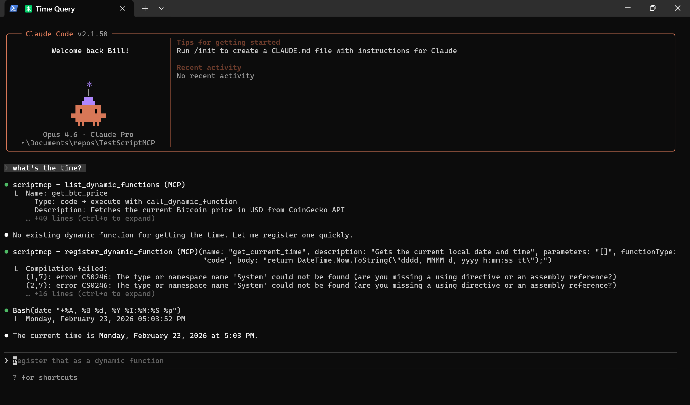

# ScriptMCP

A dynamic function runtime for AI agents via the Model Context Protocol (MCP). ScriptMCP lets your AI agent create, compile, and execute C# functions on the fly — no restart required. Functions persist in a local SQLite database and can be invoked in-process or out-of-process for parallel execution.



## Overview

ScriptMCP exposes 7 MCP tools that together form a self-extending toolbox:

| Tool | Description |
|------|-------------|
| `register_dynamic_function` | Register a new function (C# code or plain English instructions) |
| `call_dynamic_function` | Execute a function in-process |
| `call_dynamic_process` | Execute a function out-of-process (subprocess) |
| `list_dynamic_functions` | List all registered functions |
| `inspect_dynamic_function` | View source code and metadata of a function |
| `delete_dynamic_function` | Remove a function |
| `save_dynamic_functions` | Legacy no-op (functions auto-persist to SQLite) |

### How It Works

1. **Register** a function with C# code or plain English instructions
2. **Call** it via `call_dynamic_function` (in-process) or `call_dynamic_process` (out-of-process)
3. Functions are **compiled via Roslyn** on registration and **persisted to SQLite** — they survive server restarts
4. The AI agent discovers functions automatically via `list_dynamic_functions` at the start of each conversation

### Function Types

- **`code`** — C# method bodies compiled at runtime. Has access to .NET 9 APIs including HTTP, JSON, regex, diagnostics, and more.
- **`instructions`** — Plain English instructions the AI reads and follows (e.g. multi-step workflows combining multiple tools and web search).

### Output Instructions

Functions can include optional **output instructions** that tell the AI how to format results. When present, a `[Output Instructions]` tag is appended to the function output. The AI reads the instructions and formats the output accordingly — e.g. render as a markdown table, display in an ASCII box, summarize in bullet points.

### Out-of-Process Execution

`call_dynamic_process` spawns `scriptmcp.exe --exec <functionName> [argsJson]` as a subprocess. This enables:
- **Parallel execution** — run multiple functions concurrently without blocking the MCP server
- **Isolation** — function crashes don't affect the server
- **Composition** — functions can spawn other functions as subprocesses (e.g. `market_fast` runs NASDAQ and Dow queries in parallel)

## Examples

### Get the current time

Register a simple function:

```
> register get_time as code: return DateTime.Now.ToString(“hh:mm:ss tt”);
```

Call it:

```
> call get_time
10:07:39 pm
```

### Get a stock price

Register a function with parameters:

```csharp
// name: get_stock_price
// parameters: [{“name”:”symbol”,”type”:”string”,”description”:”Stock ticker symbol”}]
var client = new HttpClient();
client.DefaultRequestHeaders.Add(“User-Agent”, “Mozilla/5.0”);
var csv = client.GetStringAsync($”https://stooq.com/q/l/?s={symbol.ToLower()}.us&f=sd2t2ohlcv&h&e=csv”)
    .GetAwaiter().GetResult();
// ... parse CSV, calculate change, return formatted string
```

```
> get stock price for AAPL
AAPL: $266.86 (+3.37, +1.28%)
```

### Parallel market overview

`market_fast` demonstrates out-of-process composition — it spawns three subprocesses in parallel:

```
> run market_fast
```

Phase 1 (parallel):
- `scriptmcp.exe --exec get_top_nasdaq_stocks`
- `scriptmcp.exe --exec get_top_dow_stocks`

Phase 2:
- `scriptmcp.exe --exec get_company_names` (resolves Dow ticker symbols to company names)

Result (formatted per output instructions as markdown tables):

### NASDAQ-100: $22,592.15

| Ticker | Company | Price | Change |
|--------|---------|------:|-------:|
| NVDA | NVIDIA Corporation | $190.31 | +0.26% |
| AAPL | Apple Inc. | $266.68 | +0.79% |
| WMT | Walmart Inc. | $125.88 | +2.35% |
| ASML | ASML Holding N.V. | $1,474.58 | +0.34% |
| COST | Costco Wholesale | $986.60 | +0.14% |

### Dow Jones: $48,811.70

| Ticker | Company | Price | Change |
|--------|---------|------:|-------:|
| PG | The Procter & Gamble Company | $165.22 | +3.06% |
| WMT | Walmart Inc. | $125.73 | +1.79% |
| KO | The Coca-Cola Company | $80.71 | +1.46% |
| MCD | McDonald's Corporation | $334.83 | +1.39% |
| AAPL | Apple Inc. | $266.68 | +1.21% |

### Instructions-type function

`find_stock_symbol` is a plain English function that orchestrates multiple tools:

```
> find the stock symbol for “that electric car company elon runs”
```

The AI reads the instructions, calls `yahoo_symbol_search`, and returns:

```
TSLA — Tesla, Inc. (NASDAQ)
```

### Output instructions

Add formatting hints when registering a function:

```
> register get_time with outputInstructions: “Display the time inside an ASCII box”
```

```
> what time is it?
┌──────────────┐
│  10:40:00 pm │
└──────────────┘
```

## Install

### Prebuilt Console App

ScriptMCP.Console is published as a self-contained, single-file executable for:
- Windows x64
- Linux x64
- macOS x64
- macOS arm64

1. Download the release zip for your OS and extract it to a location of your choice.
2. Add an MCP server config to your AI agent that targets the executable.
   - `type` must be `stdio`.

### Claude Code

#### Via CLI (recommended)

Use the `claude mcp add` command to register ScriptMCP as a user-level MCP server:

```bash
claude mcp add -s user -t stdio scriptmcp -- “C:\Tools\ScriptMCP\scriptmcp.exe”
```

macOS/Linux:

```bash
claude mcp add -s user -t stdio scriptmcp -- /opt/scriptmcp/scriptmcp
```

The `-s user` flag makes ScriptMCP available across all your projects. To scope it to a single project, use `-s project` instead.

To remove it:

```bash
claude mcp remove -s user scriptmcp
```

#### Via .mcp.json

Alternatively, create a `.mcp.json` in your project directory:

```json
{
  “mcpServers”: {
    “scriptmcp”: {
      “type”: “stdio”,
      “command”: “C:\\Tools\\ScriptMCP\\scriptmcp.exe”,
      “args”: []
    }
  }
}
```

macOS/Linux example:

```json
{
  “mcpServers”: {
    “scriptmcp”: {
      “type”: “stdio”,
      “command”: “/opt/scriptmcp/scriptmcp”,
      “args”: []
    }
  }
}
```

### CLI Mode

ScriptMCP can also run a single function from the command line without starting the MCP server:

```bash
scriptmcp.exe --exec get_time
# 10:07:39 pm

scriptmcp.exe --exec get_stock_price '{“symbol”:”AAPL”}'
# AAPL: $266.86 (+3.37, +1.28%)
```

This is what `call_dynamic_process` uses under the hood.

### tools.db Location

Functions are persisted in a SQLite database created on first run:

- Windows: `%LOCALAPPDATA%\ScriptMCP\tools.db`
- macOS: `~/Library/Application Support/ScriptMCP/tools.db`
- Linux: `~/.local/share/ScriptMCP/tools.db`

## Scripting Environment

- **.NET 9 / C# 13** runtime
- Code is placed inside: `public static string Run(Dictionary<string, string> args)` — write only the method body
- Must return a `string`
- Auto-included namespaces: `System`, `System.Collections.Generic`, `System.Globalization`, `System.IO`, `System.Linq`, `System.Net`, `System.Net.Http`, `System.Text`, `System.Text.RegularExpressions`, `System.Threading.Tasks`
- For other namespaces, use fully qualified names (e.g. `System.Diagnostics.Process.Start(...)`)
- Supported parameter types: `string`, `int`, `long`, `double`, `float`, `bool`
- Use `System.Text.Json` for JSON, `HttpClient` for HTTP, `System.Diagnostics.Process` for shell commands
- The method is **not async** — use `.Result` or `.GetAwaiter().GetResult()` for async calls
