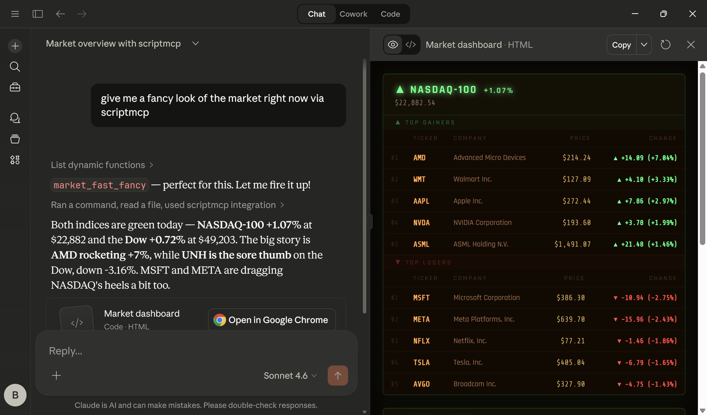
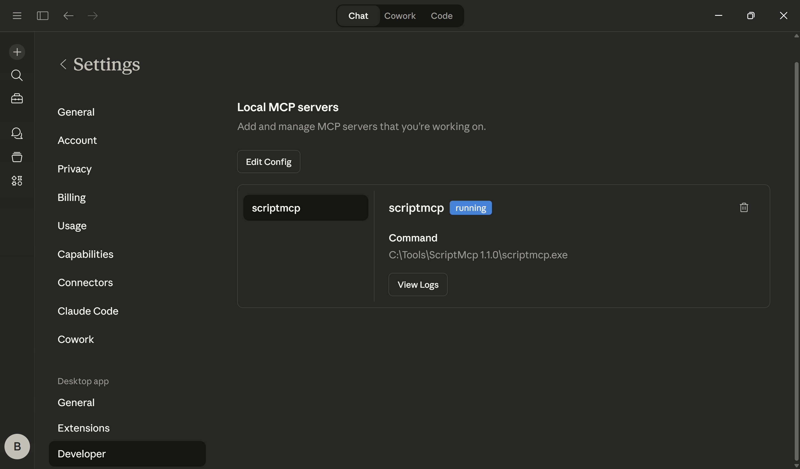

# ScriptMCP

A dynamic function runtime for AI agents via the Model Context Protocol (MCP). ScriptMCP lets your AI agent create, compile, and execute C# functions on the fly — no restart required. Functions persist in a local SQLite database and can be invoked in-process or out-of-process for parallel execution.



## Overview

ScriptMCP exposes 13 MCP tools that together form a self-extending toolbox:

| Tool | Description |
|------|-------------|
| `register_dynamic_function` | Register a new function (C# code or plain English instructions) |
| `update_dynamic_function` | Update one field on an existing function entry |
| `call_dynamic_function` | Execute a function in-process |
| `call_dynamic_process` | Execute a function out-of-process (subprocess) |
| `list_dynamic_functions` | List registered function names as a comma-delimited string |
| `inspect_dynamic_function` | View function metadata, with optional full source inspection |
| `compile_dynamic_function` | Compile a code function from its stored source |
| `delete_dynamic_function` | Remove a function |
| `save_dynamic_functions` | Legacy no-op (functions auto-persist to SQLite) |
| `create_scheduled_task` | Schedule a function to run at a recurring interval |
| `read_scheduled_task` | Read the latest scheduled-task output for a function |
| `delete_scheduled_task` | Delete a scheduled task for a function |
| `list_scheduled_tasks` | List ScriptMCP scheduled tasks |

### How It Works

1. **Register** — the AI agent writes and registers C# functions or plain English instructions on your behalf (or you provide explicit code)
2. **Update** — existing functions can be revised in place with `update_dynamic_function` when only one stored field needs to change
3. **Execute** — functions are invoked automatically by the AI via `call_dynamic_function` (in-process) or `call_dynamic_process` (out-of-process)
4. **Persist** — functions are **compiled via Roslyn** on registration and **stored in SQLite** — they survive server restarts
5. **Discover** — the AI agent discovers available functions via `list_dynamic_functions` at the start of each conversation

`update_dynamic_function` is intended for narrow edits to a single stored field such as `description`, `body`, or `output_instructions`. If the changed field affects execution (`body`, `parameters`, or `function_type`), ScriptMCP recompiles the function automatically before saving the update.

Use `update_dynamic_function` when you want to keep the same function identity and revise one field in place. Supported fields are `name`, `description`, `parameters`, `function_type`, `body`, and `output_instructions`. The `parameters` value replaces the full stored JSON array; it is not a partial merge.

If a request maps to multiple candidate functions, the agent should ask the user which one they want before inspecting any of them. Once a single candidate is chosen, the agent should inspect that function with `inspect_dynamic_function` to verify its type, purpose, and parameters before invoking it.

### Function Types

- **`code`** — C# method bodies compiled at runtime. Has access to .NET 9 APIs including HTTP, JSON, regex, diagnostics, and more.
- **`instructions`** — Plain English instructions the AI reads and follows (e.g. multi-step workflows combining multiple tools and web search).

### Output Instructions

Functions can include optional **output instructions** that tell the AI how to format results. When present, a `[Output Instructions]` tag is appended to the function output. The AI reads the instructions and formats the output accordingly — e.g. render as a markdown table, display in an ASCII box, summarize in bullet points.

### Updating an Existing Function

Use `update_dynamic_function` to edit exactly one stored field on an existing function:

```text
name:  existing function name
field: one of name, description, parameters, function_type, body, output_instructions
value: replacement value for that field
```

Typical cases:

- Rename a function without changing its behavior by updating `name`
- Refine the tool description by updating `description`
- Replace the full parameter schema by updating `parameters`
- Switch between `instructions` and `code` with `function_type`
- Replace the implementation with `body`
- Change presentation rules with `output_instructions`

If the update changes `body`, `parameters`, or `function_type`, ScriptMCP recompiles automatically and rejects the update if compilation fails.

### Out-of-Process Execution

`call_dynamic_process` spawns `scriptmcp.exe --exec <functionName> [argsJson]` as a subprocess. This enables:
- **Parallel execution** — run multiple functions concurrently without blocking the MCP server
- **Isolation** — function crashes don't affect the server
- **Composition** — functions can spawn other functions as subprocesses (e.g. `market_fast` runs NASDAQ and Dow queries in parallel)

### Scheduled Tasks

`create_scheduled_task` sets up a recurring job that runs a dynamic function at a fixed interval:

```
You:    schedule get_stock_price to run every 5 minutes with {"symbol":"AAPL"}
Agent:  [calls create_scheduled_task → function_name="get_stock_price",
         function_args='{"symbol":"AAPL"}', interval_minutes=5]
        Scheduled task created and started.
```

- **Windows** — uses Task Scheduler (`schtasks`) and runs `scriptmcp.exe --exec_out ...` directly.
- **Linux / macOS** — uses `cron`. Each entry is tagged with `# ScriptMCP:<function_name>` for easy identification and removal.

After creation, the function is immediately run once. The task uses `--exec_out` mode, which writes the function result to a timestamped file in `scheduled_task_out` beside the ScriptMCP database.

`list_scheduled_tasks` lists ScriptMCP-managed tasks:

```text
You:    list scheduled tasks
Agent:  [calls list_scheduled_tasks]
        \ScriptMCP\get_time (1m)
```

`delete_scheduled_task` removes a scheduled task created for a function:

```text
You:    delete the 5-minute stock price task
Agent:  [calls delete_scheduled_task → function_name="get_stock_price",
         interval_minutes=5]
        Scheduled task deleted.
```

- **Windows** — deletes `ScriptMCP\<function> (<interval>m)` via `schtasks /Delete`
- **Linux / macOS** — removes the cron entry tagged `# ScriptMCP:<function_name>`

### Reading Execution Output

`read_scheduled_task` reads the most recent file written for a function in `scheduled_task_out`:

```
You:    what was the last stock price result?
Agent:  [calls read_scheduled_task → function_name="get_stock_price"]
        AAPL: $266.86 (+3.37, +1.28%)
```

Each scheduled execution writes a new file named like `<function>_YYMMDD_HHMMSS.txt`. `read_scheduled_task` returns the contents of the latest matching file.

## Examples

### Let the AI create a function for you

Just describe what you need in natural language — the AI writes the C# code, registers it, and calls it:

```
You:    create a function that returns the current time, nothing else
Agent:  [registers get_time → return DateTime.Now.ToString(“hh:mm:ss tt”);]

You:    what time is it?
Agent:  10:07:39 pm
```

### Or provide explicit code

If you prefer full control, you can dictate the exact implementation:

```
You:    register a code function called get_time with body: return DateTime.Now.ToString(“hh:mm:ss tt”);
Agent:  [registers get_time with your exact code]

You:    what time is it?
Agent:  10:07:39 pm
```

### Filesystem helper

```
You:    create a function that lists all .log files under the current directory
Agent:  [registers list_logs → return Directory.GetFiles(".", "*.log", SearchOption.AllDirectories)]

You:    run list_logs
Agent:  ./logs/app.log
        ./logs/errors.log
```

### HTTP JSON fetch

```
You:    create a function that fetches a JSON endpoint and returns the top-level keys
Agent:  [registers json_keys → fetches via HttpClient, parses with System.Text.Json]

You:    run json_keys on https://api.example.com/status
Agent:  status, version, uptime
```

### Text processing

```
You:    create a function that counts words in a string input
Agent:  [registers word_count with a text parameter]

You:    word_count: "hello there general kenobi"
Agent:  4
```

### System info

```
You:    create a function that returns machine name and current uptime
Agent:  [registers uptime → uses Environment.MachineName + Environment.TickCount64]

You:    run uptime
Agent:  devbox-01 — 03:42:19
```

### Simple math utility

```
You:    create a function that converts Fahrenheit to Celsius
Agent:  [registers f_to_c with a temp parameter]

You:    f_to_c: 98.6
Agent:  37.0
```

### Small finance example (optional)

```
You:    create a function that gets the current stock price for a given ticker symbol
Agent:  [registers get_stock_price with a symbol parameter, fetches from a financial API]

You:    what's the price of AAPL?
Agent:  AAPL: $266.86 (+3.37, +1.28%)
```

### Instructions-type functions

Not everything needs code. Plain English instructions let the AI orchestrate multi-step workflows:

```
You:    find the stock ticker for “that electric car company elon runs”
Agent:  [calls find_stock_symbol → reads instructions → searches Yahoo Finance]
        TSLA — Tesla, Inc. (NASDAQ)
```

### Output instructions

Control how results are presented:

```
You:    add output instructions to get_time: “Display the time inside an ASCII box”

You:    what time is it?
Agent:  ┌──────────────┐
        │  10:40:00 pm │
        └──────────────┘
```

### Chaining functions with output instructions

Code functions can delegate work to the AI by embedding `[Output Instructions]` in their return value. This lets a code function produce data and tell the AI what to do with it next — including calling other functions.

```
You:    create get_time — returns the current time inside an ASCII box
Agent:  [registers get_time → returns ┌──────────────┐ │ 11:12:23 am │ └──────────────┘]

You:    create extract_from_box — extracts text from inside box-drawing characters
Agent:  [registers extract_from_box → parses │ delimiters, returns inner text]

You:    create get_time_string — formats "11:12:23 am" as "11 hours, 12 mins, 23 secs"
Agent:  [registers get_time_string → parses time, returns human-readable string]
```

Now chain them. `foo` calls `get_time` in code, then hands off to the AI:

```
You:    create foo — calls get_time, then tells the AI to extract the time
        and format it via the other two functions
Agent:  [registers foo as a code function]:

        var timeOutput = ScriptMCP.Call("get_time", "{}").Trim();
        return timeOutput + "\n[Output Instructions]: Call extract_from_box "
             + "with the boxed text above, then call get_time_string "
             + "with the extracted time and return exactly its result.";

You:    run foo
Agent:  [foo runs get_time → returns boxed time + output instructions]
        [AI follows instructions → calls extract_from_box → "11:12:23 am"]
        [AI follows instructions → calls get_time_string → "11 hours, 12 mins, 23 secs"]
        11 hours, 12 mins, 23 secs
```

The code function handles what code does best (calling APIs, fetching data), then the AI handles what it does best (interpreting instructions and chaining tool calls). This pattern works anywhere a code function needs the AI to take the next step.

## Install

### Prebuilt Console App

ScriptMCP.Console is published as a self-contained, single-file executable for:
- Windows x64
- Linux x64
- macOS x64
- macOS arm64

1. Download the release zip for your OS and extract it to a location of your choice (e.g. `C:\Tools\ScriptMcp 1.1.1`).
2. Add an MCP server config to your AI agent that targets the executable.
   - `type` must be `stdio`.

### Claude Code

#### Via CLI (recommended)

Use the `claude mcp add` command to register ScriptMCP as a user-level MCP server:

Windows:

```bash
claude mcp add -s user -t stdio scriptmcp -- 'C:\Tools\ScriptMcp 1.1.1\scriptmcp.exe'
```

macOS/Linux:

```bash
claude mcp add -s user -t stdio scriptmcp -- /opt/scriptmcp/scriptmcp
```

The `-s user` flag makes ScriptMCP available across all your projects. To scope it to a single project, use `-s project` instead.

To remove it:

```bash
claude mcp remove -s user scriptmcp
```

#### Via .mcp.json

Alternatively, create a `.mcp.json` in your project directory.

Windows:

```json
{
  “mcpServers”: {
    “scriptmcp”: {
      “type”: “stdio”,
      “command”: “C:\\Tools\\ScriptMcp 1.1.1\\scriptmcp.exe”,
      “args”: []
    }
  }
}
```

macOS/Linux example:

```json
{
  “mcpServers”: {
    “scriptmcp”: {
      “type”: “stdio”,
      “command”: “/opt/scriptmcp/scriptmcp”,
      “args”: []
    }
  }
}
```

### Claude Desktop

In Claude Desktop, go to **Settings → Developer** and click **Edit Config** to open `claude_desktop_config.json`. Add ScriptMCP to the `mcpServers` section:



Windows:

```json
{
  “mcpServers”: {
    “scriptmcp”: {
      “command”: “C:\\Tools\\ScriptMcp 1.1.1\\scriptmcp.exe”,
      “args”: []
    }
  }
}
```

macOS/Linux:

```json
{
  “mcpServers”: {
    “scriptmcp”: {
      “command”: “/opt/scriptmcp/scriptmcp”,
      “args”: []
    }
  }
}
```

### CLI Mode

ScriptMCP can also run a single function from the command line without starting the MCP server:

```bash
scriptmcp --exec get_time
# 10:07:39 pm

scriptmcp --exec get_stock_price '{“symbol”:”AAPL”}'
# AAPL: $266.86 (+3.37, +1.28%)
```

This is what `call_dynamic_process` uses under the hood.

Use `--exec_out` instead of `--exec` to also write the result to `scheduled_task_out` (this is what scheduled tasks use):

```bash
scriptmcp --exec_out get_stock_price '{“symbol”:”AAPL”}'
# prints to stdout AND writes a timestamped file to scheduled_task_out
```

### Codex CLI (MCP)

Codex supports MCP servers via its own config. You can add ScriptMCP to Codex in two ways:

#### Option A: CLI

Windows:

```bash
codex mcp add scriptmcp -- "C:\Tools\ScriptMcp 1.1.1\scriptmcp.exe"
```

macOS/Linux:

```bash
codex mcp add scriptmcp -- /opt/scriptmcp/scriptmcp
```

Then start Codex normally and use `/mcp` inside the TUI to verify the server is active.

To remove it:

```bash
codex mcp remove scriptmcp
```

#### Option B: config.toml

Codex stores MCP configuration in `~/.codex/config.toml` (or a project-scoped `.codex/config.toml` in trusted projects). Add a server entry:

```toml
[mcp_servers.scriptmcp]
command = "C:\\Tools\\ScriptMcp 1.1.1\\scriptmcp.exe"
# args = []
# env = { KEY = "VALUE" }
```

macOS/Linux example:

```toml
[mcp_servers.scriptmcp]
command = "/opt/scriptmcp/scriptmcp"
```

### Data Directory

Functions are persisted in a SQLite database created on first run. Execution output from `--exec_out` is stored alongside it:

- Windows: `%LOCALAPPDATA%\ScriptMCP\`
- macOS: `~/Library/Application Support/ScriptMCP/`
- Linux: `~/.local/share/ScriptMCP/`

Files in this directory:

| File | Purpose |
|------|---------|
| `tools.db` | SQLite database of registered functions |
| `scheduled_task_out/` | Timestamped output files written by `--exec_out` |

## Agent Instructions (CLAUDE.md / AGENTS.md)

ScriptMCP delivers its agent instructions automatically during the MCP handshake — when the AI agent connects to the server, it receives all the behavioral rules it needs (list functions at conversation start, ask clarifying questions when multiple candidates match, inspect before calling, respect output instructions, etc.). **No extra files are needed for normal operation.**

However, if ScriptMCP is not behaving as expected — for example, the agent isn't discovering functions, isn't asking clarifying questions, or is calling functions without inspecting first — you can reinforce the instructions by placing a markdown file in your project or globally. This gives the agent a second source of truth to fall back on.

### CLAUDE.md — Claude Code

`CLAUDE.md` is read automatically by [Claude Code](https://docs.anthropic.com/en/docs/claude-code) when it starts a session in a directory. Place it in the **project root** so Claude Code picks it up when working in the ScriptMCP repo.

**Global placement** — To avoid duplicating `CLAUDE.md` in every project, you can place it at the user level:

```
~/.claude/CLAUDE.md
```

On Windows: `%USERPROFILE%\.claude\CLAUDE.md`

A user-level `CLAUDE.md` is loaded into every Claude Code session regardless of working directory. This is ideal if you use ScriptMCP across multiple projects. If both a global and a project-level `CLAUDE.md` exist, Claude Code merges them (project-level instructions take priority for conflicts).

### AGENTS.md — OpenAI Codex

`AGENTS.md` is read automatically by [OpenAI Codex CLI](https://github.com/openai/codex) when it enters a directory. Codex reads `AGENTS.md` files at every level of the directory tree it traverses, so placing one in the project root covers the entire repo.

**Global placement** — Codex does not have a dedicated global instructions path like Claude Code. However, you can place an `AGENTS.md` in your **home directory** (`~/AGENTS.md`), and it will be picked up when Codex operates from any subdirectory beneath it. Alternatively, place it in a common parent directory of your projects.

### Which file do I need?

| Agent | File | Global location |
|-------|------|-----------------|
| Claude Code | `CLAUDE.md` | `~/.claude/CLAUDE.md` |
| OpenAI Codex | `AGENTS.md` | `~/AGENTS.md` (or common parent directory) |

If you only use one agent, you only need the corresponding file. Both files contain the same instructions — just formatted for each agent's conventions.

## Scripting Environment

- **.NET 9 / C# 13** runtime — no .NET installation required, the executable is self-contained
