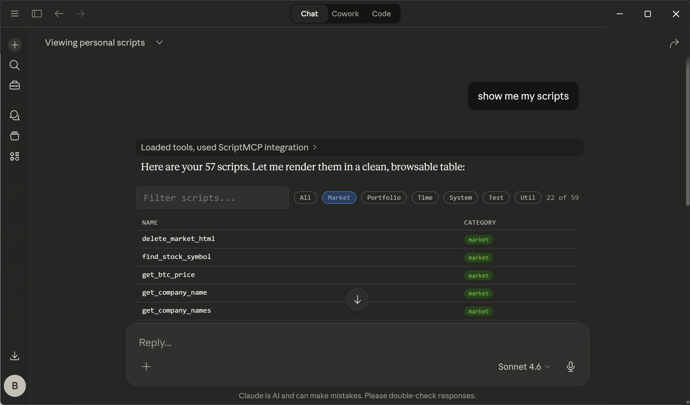

# ScriptMCP

A script runtime for AI agents via the Model Context Protocol (MCP). ScriptMCP lets your AI agent create, compile, and execute C# scripts on the fly — no restart required. Scripts persist in a local SQLite database and can be invoked in-process or out-of-process for parallel execution.



## Install

**Windows (PowerShell):**
```
powershell -c "irm https://sithiro.github.io/ScriptMCP/install.ps1 | iex"
```

**Linux/macOS:**
```bash
curl -fsSL https://sithiro.github.io/ScriptMCP/install.sh | bash
```

After downloading, register with your agent:

```bash
claude mcp add -s user -t stdio scriptmcp -- /path/to/scriptmcp       # Claude Code
codex mcp add scriptmcp -- /path/to/scriptmcp                          # Codex
code --add-mcp '{"name":"scriptmcp","command":"/path/to/scriptmcp","args":[]}' # Copilot
```

## Overview

ScriptMCP exposes 20 MCP tools that together form a self-extending toolbox. You interact with the agent in natural language — the agent decides which tools to call.

```
AI Agent ──► MCP Protocol ──► ScriptMCP Server ──► .NET 9 ──► Execute ──┐
   ▲                                │                                   │
   │                                ▼                                   │
   │                          Roslyn Compiler                           │
   │                                │                                   │
   │                                ▼                                   │
   │                          SQLite Database                           │
   │                       (scripts + assemblies)                       │
   │                                                                    │
   └──────────────────────── Result ◄───────────────────────────────────┘
```

### How It Works

1. **You ask** — describe what you need in plain English
2. **The agent builds** — the AI writes C# code, compiles it via Roslyn, and stores it in SQLite
3. **It runs** — the agent executes the script and returns the result
4. **It persists** — scripts survive server restarts and can be reused across sessions
5. **It grows** — scripts can be updated, composed, scheduled, and shared across databases

### Script Types

- **Code** — top-level C# source compiled at runtime on .NET 9 / C# 13. Output via `Console.Write` / `Console.WriteLine`.
- **Instructions** — plain English steps the AI reads and follows (e.g. multi-step workflows combining tools and web search).

### Directives

Code scripts support `#r "path.dll"` to reference external .NET assemblies and `#load "path.cs"` to include shared C# source files. Directives appear at the top of the script before any code.

## Examples

### Create a script with natural language

Just describe what you need — the AI writes the code, compiles it, and runs it:

```
You:    create a script that returns exactly the current time
Agent:  Script 'get_time' created successfully.

You:    what time is it?
Agent:  10:07:39 pm
```

Behind the scenes, the agent wrote and compiled this C# script:

```csharp
Console.Write(DateTime.Now.ToString("h:mm:ss tt").ToLower());
```

### Parameterized scripts

```
You:    create a script called fibonacci that takes a number n and returns the nth fibonacci number
Agent:  Script 'fibonacci' created successfully with 1 parameter(s).

You:    calculate fibonacci for 12
Agent:  144
```

### Instructions scripts

Not everything needs code. Create a script with plain English instructions:

```
You:    create a script called find_stock_symbol with these instructions:
        1) Take the user's description and search Yahoo Finance for a matching ticker
        2) Return the ticker symbol, company name, and exchange

You:    find the stock ticker for "that electric car company elon runs"
Agent:  TSLA — Tesla, Inc. (NASDAQ)
```

### Script chaining

Scripts build on each other. The agent chains them automatically when your request spans multiple scripts:

```
You:    create a script that gets the current price of bitcoin in USD
Agent:  Script 'get_btc_price' created successfully.

You:    create a script that converts a USD amount to EUR
Agent:  Script 'usd_to_eur' created successfully with 1 parameter(s).

You:    what's bitcoin worth in euros?
Agent:  €59,473.22
```

The agent calls `get_btc_price` first, feeds the result into `usd_to_eur`, and returns the final converted price.

### Scheduling

```
You:    schedule get_stock_price to run every 5 minutes with symbol AAPL
Agent:  Scheduled task created and started.

You:    what was the last stock price result?
Agent:  AAPL: $266.86 (+3.37, +1.28%)

You:    change it to every 10 minutes
Agent:  Rescheduled to every 10 minutes.

You:    delete the stock price task
Agent:  Scheduled task deleted.
```

### Switching databases

```
You:    which database is active?
Agent:  C:\Users\you\AppData\Local\ScriptMCP\scriptmcp.db

You:    switch to sandbox
Agent:  Database does not exist. Create it?

You:    yes
Agent:  Switched to sandbox.db
```

### Loading a script from a file

If you prefer to author scripts in your editor, you can load them from disk:

```
You:    load the script from C:\work\weather.cs
Agent:  Script 'weather' loaded and created.

You:    I changed the file, reload it
Agent:  Script 'weather' updated from file.
```

### Referencing external libraries

```
You:    create a script that uses my MathLib.dll to calculate circle areas

Agent:  (creates a script with #r "C:/libs/MathLib.dll" at the top)

You:    what's the area of a circle with radius 5?
Agent:  78.54
```

## MCP Tools

ScriptMCP provides 20 tools across four categories. You don't call these directly — the agent uses them based on your natural language requests.

| Category | Tools | What you say (examples) |
|----------|-------|-------------|
| **Script lifecycle** | create, list, inspect, update, delete | "create a script that...", "show me my scripts", "delete fibonacci" |
| **Execution** | call_script, call_process | "run get_time", "what's the weather?" |
| **File sync** | load, export, compile | "load script from file", "export to disk", "compile to DLL" |
| **Database** | get, set, delete database | "which database?", "switch to work.db" |
| **Scheduling** | create, list, read, start, stop, delete task | "schedule X every 5 minutes", "show last result" |

For the full tool reference, see the [wiki](https://github.com/sithiro/ScriptMCP/wiki/MCP-Tools-Reference).

## Repository Structure

| Folder | Purpose |
| ------ | ------- |
| `ScriptMCP.Console` | The MCP server entry point — hosts the stdio transport and wires up all tools |
| `ScriptMCP.Library` | Core library containing script management, compilation, and tool definitions |
| `ScriptMCP.Extension` | Packaging for Claude Desktop — contains `manifest.json` and a `server/` folder for the binary |
| `ScriptMCP.Plugin` | Claude Code plugin — slash commands, hooks, skills, and MCP server configuration |
| `ScriptMCP.Tests` | Unit and integration tests |

## More Installation Options

### Claude Desktop

#### a) Extension (MCP server)

Download the `.mcpb` file for your platform from the [latest release](https://github.com/sithiro/ScriptMCP/releases/latest):

| Platform | File |
| -------- | ---- |
| Windows x64 | `scriptmcp-win-x64.mcpb` |
| Linux x64 | `scriptmcp-linux-x64.mcpb` |
| macOS arm64 (Apple Silicon) | `scriptmcp-osx-arm64.mcpb` |

Open the `.mcpb` file in Claude Desktop to install the ScriptMCP extension. This provides the MCP server and all 20 tools.


#### b) Plugin (slash commands, skills, hooks)

Download `scriptmcp-plugin.zip` from the [latest release](https://github.com/sithiro/ScriptMCP/releases/latest) and install it as a Claude Desktop plugin. The plugin adds slash commands, skills, and hooks that complement the extension.


The plugin requires the ScriptMCP extension (step a) to be installed first.

### Running from Source

If you prefer to run ScriptMCP from source instead of using the extension, install the [.NET 9 SDK](https://dotnet.microsoft.com/download/dotnet/9.0) and configure it as an MCP server.

#### Claude Code CLI

```bash
claude mcp add -s user -t stdio scriptmcp -- dotnet run --project /path/to/ScriptMCP.Console/ScriptMCP.Console.csproj -c Release
```

The `-s user` flag makes ScriptMCP available across all your projects. To scope it to a single project, use `-s project` instead.

To remove it:

```bash
claude mcp remove -s user scriptmcp
```

#### Claude Desktop (manual config)

Go to **Settings → Developer** and click **Edit Config** to open `claude_desktop_config.json`:

```json
{
  "mcpServers": {
    "scriptmcp": {
      "command": "dotnet",
      "args": ["run", "--project", "/path/to/ScriptMCP.Console/ScriptMCP.Console.csproj", "-c", "Release"]
    }
  }
}
```

#### Codex CLI

```bash
codex mcp add scriptmcp -- dotnet run --project /path/to/ScriptMCP.Console/ScriptMCP.Console.csproj -c Release
```

Then start Codex normally and use `/mcp` inside the TUI to verify the server is active.

To remove it:

```bash
codex mcp remove scriptmcp
```

### CLI Usage

ScriptMCP can also be used directly from the command line:

```bash
scriptmcp --exec get_time
scriptmcp --exec get_stock_price '{"symbol":"AAPL"}'
scriptmcp --db work.db --exec get_time
```

| Argument | Description |
|----------|-------------|
| `--db <path>` | Use a specific database (relative names resolve under the default data directory) |
| `--exec <name> [args]` | Execute a script and write result to stdout |
| `--exec-out <name> [args]` | Execute and save output to a timestamped file |
| `--exec-out-append <name> [args]` | Execute and append output to a stable file |

### Data Directory

Scripts are persisted in a SQLite database created on first run:

- Windows: `%LOCALAPPDATA%\ScriptMCP\`
- macOS: `~/Library/Application Support/ScriptMCP/`
- Linux: `~/.local/share/ScriptMCP/`

## Documentation

For tutorials, recipes, and full tool reference, see the [ScriptMCP Wiki](https://github.com/sithiro/ScriptMCP/wiki).

## Agent Instructions (CLAUDE.md / AGENTS.md)

ScriptMCP delivers its agent instructions automatically during the MCP handshake — **no extra files are needed for normal operation.**

If ScriptMCP is not behaving as expected, you can reinforce the instructions by placing a markdown file in your project or globally:

| Agent        | File        | Global location                            |
| ------------ | ----------- | ------------------------------------------ |
| Claude Code  | `CLAUDE.md` | `~/.claude/CLAUDE.md`                      |
| OpenAI Codex | `AGENTS.md` | `~/AGENTS.md` (or common parent directory) |

## Scripting Environment

- **.NET 9 / C# 13** runtime
- Self-contained release zips do not require a separate .NET installation
- Framework-dependent release zips require a compatible .NET 9 runtime on the target machine
